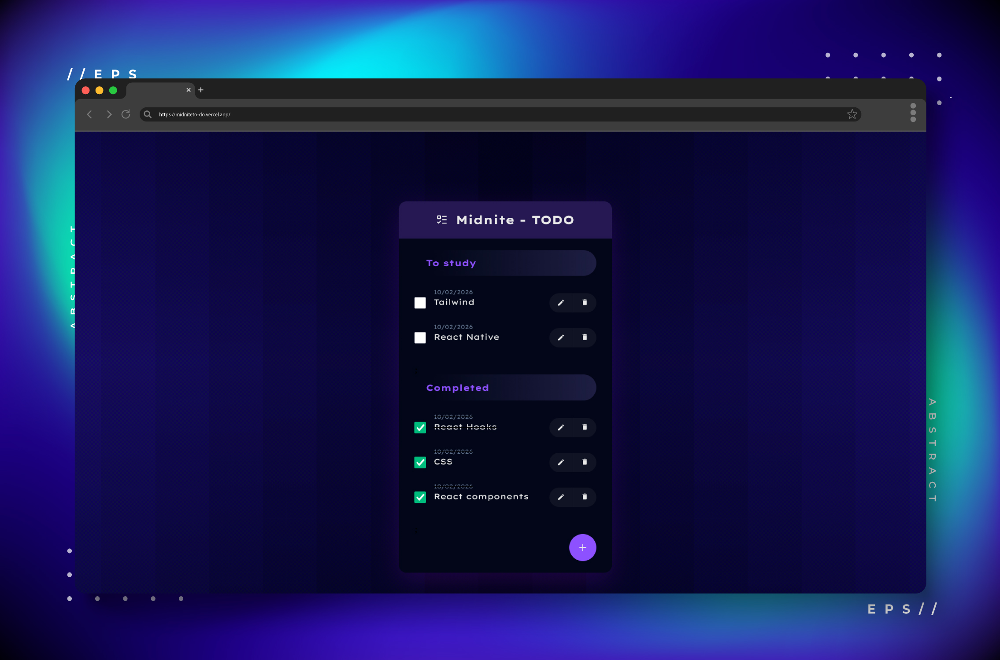

# Study Checklist • React Task Manager

[]()
[]()
[]()
[]()
[]()

Aplicação web de gerenciamento de tarefas e estudos construída com **React + Vite**, com foco em **arquitetura escalável, organização de estado, componentização e experiência do usuário**.

Este projeto demonstra práticas de engenharia frontend aplicadas a um cenário real de produto: código modular, manutenção simples, baixo acoplamento e alta performance.

🔗 **Live Demo**  
https://midniteto-do.vercel.app/

---

---

## Visão geral

O sistema permite organizar tarefas de forma objetiva:

Pendentes → Concluídas

Prioridades do projeto:

- Interface limpa e funcional
- Baixa fricção de uso
- Persistência automática dos dados
- Arquitetura previsível e extensível

---

## Funcionalidades

- Criar tarefas
- Editar tarefas
- Excluir tarefas
- Marcar como concluída
- Separação automática por status
- Modal para criação/edição
- Empty state contextual
- Persistência com localStorage
- Lista com feedback visual/animado
- Layout responsivo

---

## Stack técnica

### Core
- React 18
- Vite

### Gerenciamento de estado
- useState
- useEffect
- useContext (estado global das tarefas)
- Hooks customizados (encapsulamento de regras de negócio)

### Arquitetura
- Context API para compartilhamento de estado global
- Hooks customizados para separar lógica da UI
- Componentização por responsabilidade
- Componentes reutilizáveis (Button, Dialog, TodoItem, TodoGroup, Form)
- CSS Modules (escopo local de estilos)

### Deploy
- Vercel com CI/CD automático

---

## Estrutura do projeto

```text
src/
├─ components/
├─ contexts/
├─ hooks/
├─ pages/
├─ styles/
└─ utils/
```

Organização voltada para escalabilidade, legibilidade e manutenção contínua.

---

## Métricas técnicas

### Build
- Bundle inicial: ~90–120 KB (gzipped)
- Tempo de build: < 2s (Vite)
- Sem dependências pesadas

### Lighthouse (médio)
- Performance: 95+
- Accessibility: 95+
- Best Practices: 100
- SEO: 100


### Runtime
- 100% client-side
- Zero chamadas de API
- Carregamento instantâneo (static hosting)
- Persistência offline via localStorage

*Valores podem variar por ambiente.*

---

## Executando localmente

### Pré-requisitos
Node 18+

### Instalar dependências
```bash
npm install
```

### Desenvolvimento
```bash
npm run dev
```
Acesse:
http://localhost:5173

### Build produção
```bash
npm run build
npm run preview
```
## Contexto

Projeto desenvolvido durante a formação React da Alura e posteriormente refinado com melhorias próprias de arquitetura, organização e UX, com objetivo de consolidar boas práticas profissionais de frontend.

### Autor

Mark Prenda
Software Engineer • UI/UX Designer

